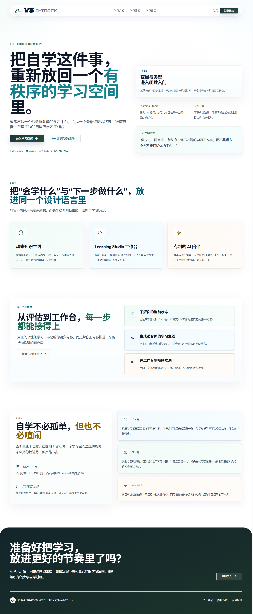
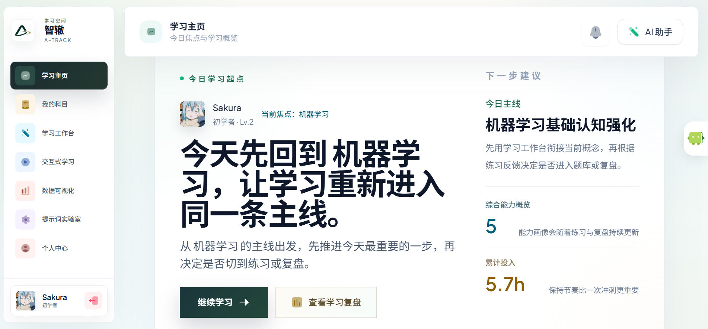
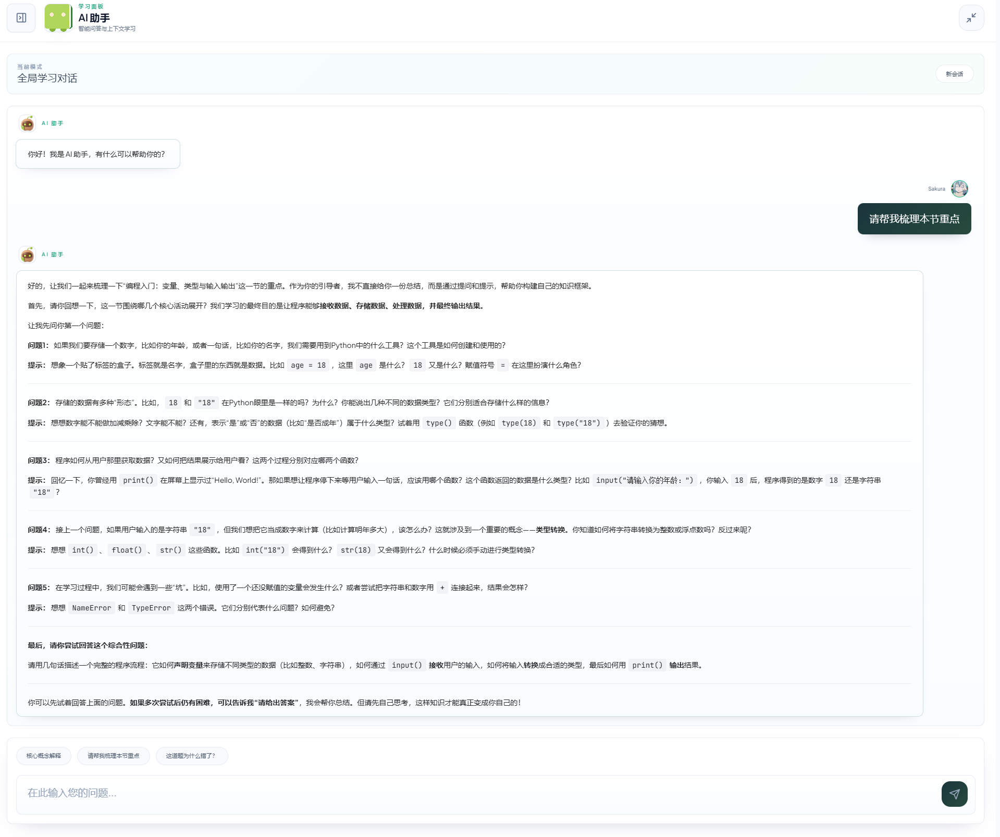
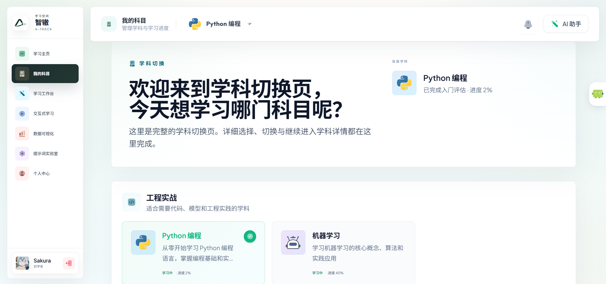
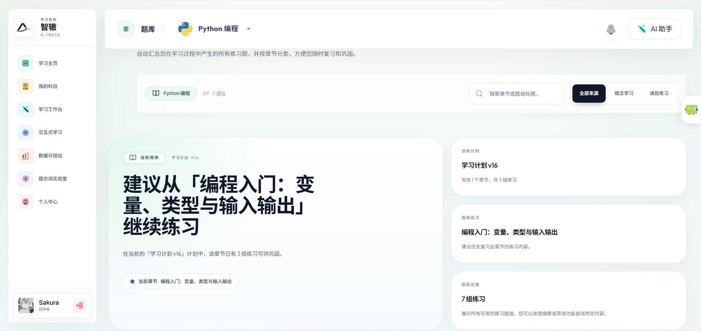
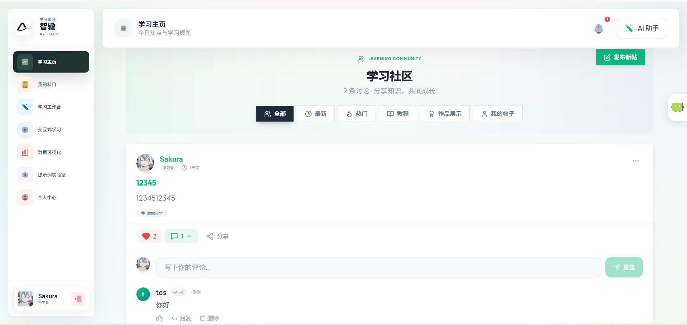
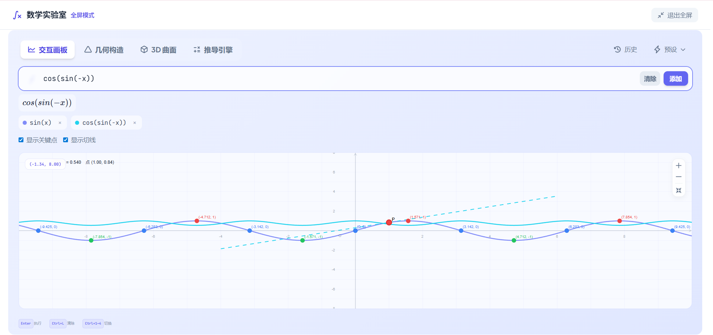

<div align="center">


# A-Track · 智辙

**AI 驱动的多学科自适应学习平台**

_AI 智慧为学生铺好知识的轨迹_

[English](./README.en.md) · [在线演示](http://8.148.82.93/) · [变更日志](CHANGELOG.md) · [贡献指南](CONTRIBUTING.md)

[](LICENSE)
[](https://github.com/Sakuraxk/a-track/stargazers)
[](https://github.com/Sakuraxk/a-track/issues)
[](https://github.com/Sakuraxk/a-track/pulls)

[](#)
[](#)
[](#)
[](#)
[](#)
[](#)
[](#)

</div>

---

<div align="center">
  
</div>

<div align="center">

> 🎓 涵盖 **7 大核心学科**：**Python 编程** · **机器学习** · **高等数学** · **概率论** · **线性代数** · **统计学** · **AI 通识与 AI 素养**
>
> 配备独立的 **管理后台面板**，用于用户管理、学科管理、学习数据分析和系统配置。

</div>

<!--
🎬 演示视频嵌入说明：
1. 在 GitHub 上编辑此 README
2. 将 docs/images/demo.mp4 拖拽到编辑器中
3. GitHub 会自动上传并生成链接
4. 用生成的链接替换下方的占位 URL
-->

<div align="center">

📺 **[▶ 点击观看演示视频](http://8.148.82.93/)** | 访问在线 Demo 体验完整功能

</div>

---

## 📑 目录

- [✨ 核心特性](#-核心特性)
- [🚀 快速开始](#-快速开始)
- [🛠️ 技术栈](#️-技术栈)
- [📸 功能展示](#-功能展示)
- [🎓 使用流程](#-使用流程)
- [⚙️ AI 功能配置](#️-ai-功能配置)
- [📂 项目结构](#-项目结构)
- [📚 API 端点概览](#-api-端点概览)
- [🔧 开发指南](#-开发指南)
- [🛠️ 常见问题](#️-常见问题)
- [🤝 贡献](#-贡献)
- [📄 License](#-license)

---

## ✨ 核心特性

<table>
<tr>
<td width="50%">

### 🎯 智能水平评估
快速测验生成能力画像，精准定位知识薄弱点，为每位学生量身打造学习起点。

</td>
<td width="50%">

### 🤖 苏格拉底 AI 导师
引导式教学而非直接给答案，结合用户记忆流提供个性化提示与深度辅导。

</td>
</tr>
<tr>
<td width="50%">

### 🗺️ 动态知识图谱
基于学科特性构建可视化知识树与前置依赖，清晰呈现知识脉络。

</td>
<td width="50%">

### 🧠 用户记忆系统
跨学习周期追踪行为、偏好与学习模式，AI 越用越懂你。

</td>
</tr>
<tr>
<td width="50%">

### 💻 交互式练习环境
工程学科代码展示 + 前端轻量执行 / 后端独立沙箱执行 + 多样化题型练习。

</td>
<td width="50%">

### 📖 概念学习工作台
流式生成学习内容，内嵌 AI 提问与 SVG 配图，沉浸式学习体验。

</td>
</tr>
<tr>
<td width="50%">

### 🛤️ AI 学习路线规划
AI 生成多阶段个性化学习计划与每日任务，让学习不再迷茫。

</td>
<td width="50%">

### 📊 能力雷达图
多维度可视化展示学习进度与成就，直观了解自身实力分布。

</td>
</tr>
</table>

<details>
<summary><b>🔽 更多特性</b></summary>

| 模块 | 说明 |
|------|------|
| 📚 **多学科沉浸式学习** | 涵盖文理科核心课程的系统化学习路径 |
| 📝 **智能题库** | AI 生成题目，按难度/知识点自动编排 |
| 🏆 **成就树系统** | 章节级进度可视化与成就解锁 |
| 💬 **学习社区** | 帖子分享、点赞、评论与互动通知 |
| 🔔 **游戏化通知** | 完成任务时的成就庆祝与激励反馈 |
| 🎛️ **Prompt Lab** | 开发环境的 Prompt 编辑、版本管理与调试工具 |
| 📐 **数学实验室** | 交互式数学公式计算、JSXGraph 函数图形绘制 |
| 🃏 **闪卡记忆系统** | 基于间隔重复算法的闪卡学习工具 |
| 🎲 **GPT-Vis 可视化** | 基于 @antv/gpt-vis 的智能图表渲染 Playground |
| 🧊 **3D 可视化画布** | 基于 Three.js 的 3D 交互式学习场景 |
| 📱 **互动式课程学习** | 结构化课程体系，含章节详情沉浸式学习 |
| 🏢 **管理后台** | 独立 Vue 3 管理面板，用户/学科/社区管理与数据分析 |

</details>

---

## 🚀 快速开始

> **前提**：确保 [Docker Desktop](https://www.docker.com/products/docker-desktop/) 已安装并正在运行。

### 1️⃣ 克隆项目

```bash
git clone https://github.com/Sakuraxk/a-track.git
cd a-track
```

### 2️⃣ 一键启动

```powershell
# Windows PowerShell
.\deploy.ps1

# Linux / macOS
chmod +x deploy.sh && ./deploy.sh
```

### 3️⃣ 初始化数据

```powershell
.\deploy.ps1 -Migrate   # 数据库迁移
.\deploy.ps1 -Seed      # 初始化学科数据
```

### 🎉 打开浏览器

| 地址 | 说明 |
|------|------|
| `http://localhost` | 🌐 前端应用 |
| `http://localhost/admin/` | 🏢 管理后台 |
| `http://localhost/docs` | 📖 API 文档 (Swagger) |

<details>
<summary><b>🔥 开发模式（热重载）</b></summary>

```powershell
.\deploy.ps1 -Dev         # 启动开发模式（热重载）
.\deploy.ps1 -DevDown     # 停止开发模式
```

| 操作 | 命令 |
|------|------|
| 🚀 启动开发模式 | `.\deploy.ps1 -Dev` |
| 🛑 停止开发模式 | `.\deploy.ps1 -DevDown` |
| 🔨 生产模式启动 | `.\deploy.ps1` |
| 🔨 强制重建启动 | `.\deploy.ps1 -Build` |
| 📋 查看日志 | `.\deploy.ps1 -Logs` |
| 🗄️ 数据库迁移 | `.\deploy.ps1 -Migrate` |
| 🌱 初始化学科数据 | `.\deploy.ps1 -Seed` |
| ⬇️ 停止生产模式 | `.\deploy.ps1 -Down` |

</details>

---

## 🛠️ 技术栈

<table>
<tr>
<td align="center" width="33%">

### 后端

[](#)
[](#)
[](#)
[](#)
[](#)

</td>
<td align="center" width="33%">

### 前端

[](#)
[](#)
[](#)
[](#)
[](#)

</td>
<td align="center" width="33%">

### 管理后台

[](#)
[](#)
[](#)

</td>
</tr>
</table>

<div align="center">

[](#)

</div>

---

## 📸 功能展示

<table>
<tr>
<td align="center" width="50%">

**🏠 学习主页**



_个性化学习起点与今日推荐_

</td>
<td align="center" width="50%">

**🤖 AI 苏格拉底导师**



_引导式教学，用提问激发深度思考_

</td>
</tr>
<tr>
<td align="center" width="50%">

**📚 多学科管理**



_工程实战与理论学科自由切换_

</td>
<td align="center" width="50%">

**📝 智能题库**



_AI 组题，按知识点与难度筛选_

</td>
</tr>
<tr>
<td align="center" width="50%">

**💬 学习社区**



_知识分享、互动讨论与社区交流_

</td>
<td align="center" width="50%">

**📐 数学实验室**



_交互式函数图形绘制与公式计算_

</td>
</tr>
</table>

> 💡 **提示**：访问 [在线演示](http://8.148.82.93/) 体验完整功能。

---

## 🎓 使用流程

```
注册账号 → 选择学科 → 完成评估 → 获取个性化方案 → 开始学习
```

<details>
<summary><b>📋 详细功能导览</b></summary>

| 功能模块 | 入口 | 说明 |
|----------|------|------|
| **仪表盘** | `/app/dashboard` | 跨学科进展概览、能力雷达图、学习统计 |
| **学科切换** | `/app/subjects` | 多学科选择与切换 |
| **学习工作台** | `/app/studio/:id` | 概念学习、AI 提问和练习的沉浸式空间 |
| **AI 学习路线** | `/app/ai-learning-path` | AI 生成多阶段个性化学习计划 |
| **智能题库** | `/app/question-bank` | AI 组题、按知识点/难度筛选 |
| **学习统计** | `/app/stats` | 多维度数据分析与学习报告 |
| **个人中心** | `/app/profile` | 能力模型、行为历史和学习模式分析 |
| **互动式学习** | `/app/interactive-learning` | 结构化课程列表与学习 |
| **GPT-Vis** | `/app/gpt-vis` | GPT-Vis 可视化图表 Playground |
| **管理后台** | `/admin/` | 用户/学科/社区管理与数据分析 |

</details>

---

## ⚙️ AI 功能配置

### 方式一：配置文件（推荐）

编辑 `backend/config.toml`：

```toml
[llm.system]
api_key = "sk-your-api-key-here"
base_url = "https://api.deepseek.com"
model = "deepseek-v4-flash"
enabled = true
```

<details>
<summary><b>📋 常用 API 服务商</b></summary>

| 服务商 | base_url | model |
|--------|----------|-------|
| DeepSeek | `https://api.deepseek.com` | `deepseek-v4-flash` / `deepseek-v4-pro` |
| OpenAI | `https://api.openai.com/v1` | `gpt-3.5-turbo` |
| 通义千问 | `https://dashscope.aliyuncs.com/compatible-mode/v1` | `qwen-turbo` |

</details>

### 方式二：可视化配置

访问 `http://localhost:8010/config` 通过 Web 界面配置。

---

## 📂 项目结构

```
a-track/
├── backend/                          # FastAPI 后端
│   ├── app/
│   │   ├── core/                     # 核心基础设施
│   │   ├── models/                   # SQLAlchemy 数据模型
│   │   ├── schemas/                  # Pydantic 请求/响应模型
│   │   ├── routers/                  # API 路由
│   │   ├── services/                 # 业务逻辑层
│   │   ├── prompts/                  # Prompt 管理系统
│   │   ├── dependencies/             # FastAPI 依赖注入
│   │   └── main.py                   # 应用入口
│   ├── scripts/                      # 运维脚本
│   ├── tests/                        # 后端测试
│   ├── alembic/                      # 数据库迁移
│   ├── sandbox_worker/               # 独立代码沙箱服务
│   └── config.toml                   # 应用配置文件
├── frontend/                         # React + TypeScript 前端
│   └── src/
│       ├── pages/                    # 页面组件
│       ├── components/               # 可复用组件
│       ├── stores/                   # Zustand 状态管理
│       └── lib/                      # 工具函数 & API 客户端
├── admin/                            # Vue 3 管理后台面板
├── nginx/                            # Nginx 配置
├── docs/                             # 项目文档
├── docker-compose.yml                # 生产配置
├── docker-compose.dev.yml            # 开发配置（热重载）
├── deploy.ps1 / deploy.sh            # 一键部署脚本
└── README.md                         # 本文件
```

---

## 📚 API 端点概览

| 前缀 | 功能 | 说明 |
|------|------|------|
| `/api/auth` | 🔐 用户认证 | 注册、登录、JWT Token |
| `/api/subjects` | 📘 学科管理 | 学科列表、章节、切换学科 |
| `/api/assessment` | 🎯 水平评估 | 自适应评估题生成与分析 |
| `/api/practice` | 📝 练习系统 | 多题型练习、代码执行 |
| `/api/question-bank` | 📝 智能题库 | AI 组题、批量生成 |
| `/api/concept-learning` | 📖 概念学习 | 流式内容生成、AI 提问 |
| `/api/graph` | 🗺️ 知识图谱 | 知识节点与依赖关系 |
| `/api/ai-learning-path` | 🛤️ AI 学习路线 | 个性化学习计划 |
| `/api/ai-tutor` | 🤖 AI 导师 | 苏格拉底式对话 |
| `/api/community` | 💬 学习社区 | 帖子、评论、点赞 |
| `/api/reporting` | 📈 学习报告 | 进度统计与分析 |
| `/api/user-memory` | 🧠 用户记忆 | 行为追踪与偏好 |

> 完整 API 文档：`http://localhost:8010/docs`

---

## 🔧 开发指南

```bash
# 后端测试
cd backend && uv run pytest

# 前端测试
cd frontend && npm run test:run

# 代码格式化
cd backend && uv run black . && uv run isort .
cd frontend && npm run lint
```

> 📋 代码审查清单见 `docs/code-review.md`

---

## 🛠️ 常见问题

<details>
<summary><b>Q: docker-compose up -d 报错端口被占用？</b></summary>

修改 `.env` 中的端口（如 `FRONTEND_PORT=8080`），然后重新启动。
</details>

<details>
<summary><b>Q: AI 导师不直接给答案？</b></summary>

这是设计特性 — 采用苏格拉底式教学法。如需直接答案，设置 `{ "request_direct_answer": true }`。
</details>

<details>
<summary><b>Q: 如何切换 LLM 模型？</b></summary>

修改 `backend/config.toml` 的 `model` 字段，或通过 `http://localhost:8010/config` 切换。
</details>

<details>
<summary><b>Q: 在 cmd 终端中无法运行 .ps1 脚本？</b></summary>

加前缀：`powershell .\deploy.ps1 -Dev`，或直接使用 PowerShell 终端。
</details>

---

## 🤝 贡献

欢迎贡献！请阅读 [CONTRIBUTING.md](CONTRIBUTING.md) 了解详情。

[](https://github.com/Sakuraxk/a-track/graphs/contributors)

---

## ⭐ Star History

如果觉得项目有帮助，请给一个 ⭐ 支持！

[](https://star-history.com/#Sakuraxk/a-track&Date)

---

## 📖 参考文档

[FastAPI](https://fastapi.tiangolo.com/) · [SQLAlchemy](https://docs.sqlalchemy.org/) · [React](https://react.dev/) · [Vite](https://vitejs.dev/) · [Tailwind CSS](https://tailwindcss.com/) · [Vue 3](https://vuejs.org/) · [Three.js](https://threejs.org/)

---

## 📄 License

本项目采用 [MIT 许可证](LICENSE) 开源。

<div align="center">

**[⬆ 回到顶部](#a-track--智辙)**

Made with ❤️ by [A-Track Team](https://github.com/Sakuraxk/a-track)

</div>
